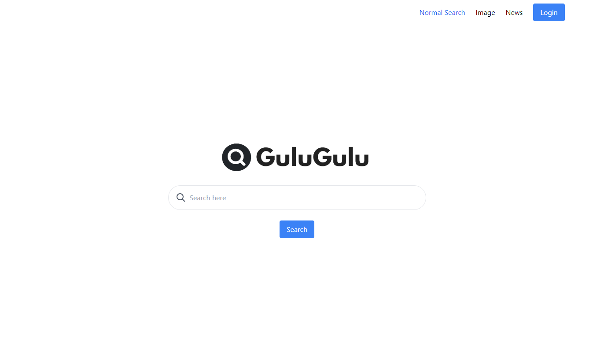
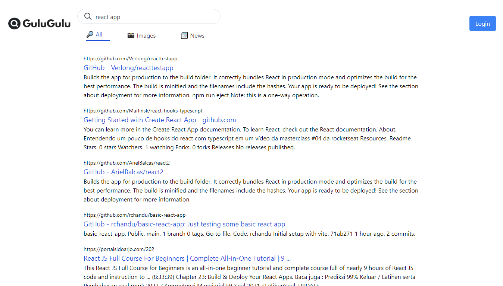
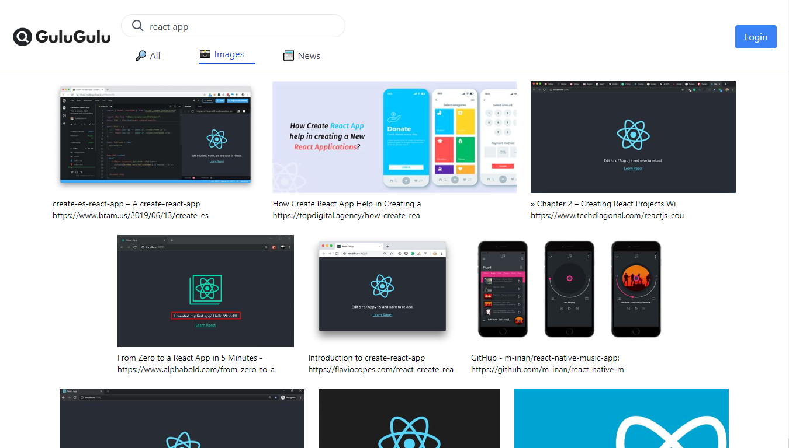
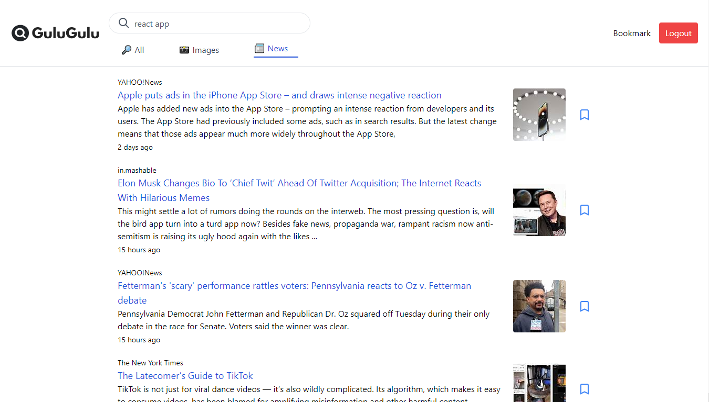
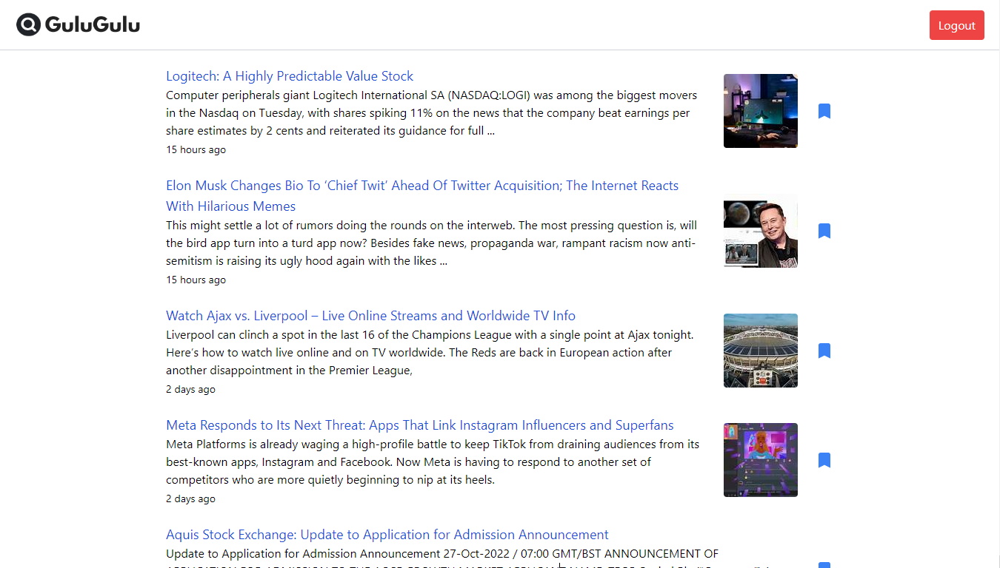
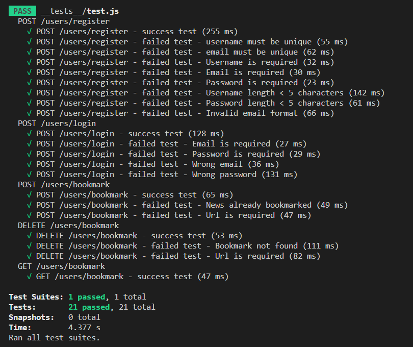
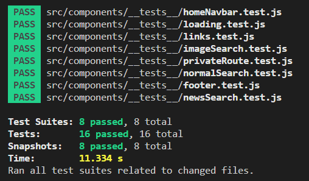

# Gulu-Gulu Web Search

A simple Google search clone which allow user to search for information such as web search, image search and news search. Created with React Js, Redux, and Tailwind as the main styling utility.

This project is created using [Bing Web Search API](https://rapidapi.com/microsoft-azure-org-microsoft-cognitive-services/api/bing-web-search1/), [Bing Image Search API](https://rapidapi.com/microsoft-azure-org-microsoft-cognitive-services/api/bing-image-search1/), and [Bing News Search API](https://rapidapi.com/microsoft-azure-org-microsoft-cognitive-services/api/bing-news-search1/). In order to work with the API's, you need to subscribe the Basic Plan (no additional fee).

## Features

- Web search, image search, and news search.
- User has news bookmark list and can add and remove on their to their own reading list (need to login first).

## Project Setup

- Server

  For local development, create a local `.env` file using template from `.env.template`.

  Install dependency modules.

  ```
  npm install
  ```

  Run and compile server scripts.

  ```
  npm run dev
  ```

- Client

  For local development, create a local `.env` file using template from `.env.template`.

  Install dependency modules.

  ```
  npm install
  ```

  Run and compile client scripts.

  ```
  npm start
  ```

## Screenshots

### Homepage



### Web Search



### Image Search



### News Search



### Bookmark



### Server Test



### Unit Render Test


